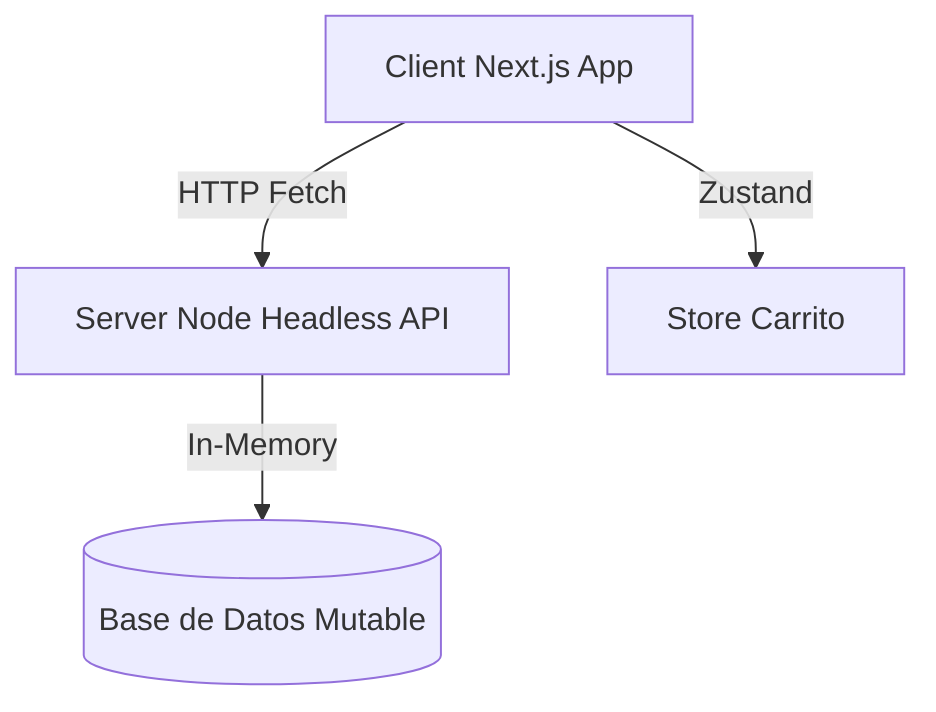

# Ecommerce Equilibrium 🛍️

Plataforma de comercio electrónico moderna, modular y escalable. Estructura desacoplada en `Client/` (Next.js) y `Server/` (Headless API).

---

## 🏗️ Arquitectura General y Estructura

* **Client/ (Puerto 3000)**: React 18, App Router de Next.js, Zustand (estado global), TanStack Query (sincronización reactiva) y styling con Tailwind CSS + Base UI.
* **Server/ (Puerto 3001)**: Node.js con Next.js Headless Route Handlers, arquitectura en tres capas: Repositorio (datos), Servicio (lógica de negocio) y Controladores (Rutas API).

---

## 🔌 Endpoints Backend Disponibles

* `GET /api/categorias`: Listado completo de categorías de catálogo.
* `GET /api/productos`: Catálogo filtrado por texto, categorías, rango de precio y orden.
* `GET /api/productos/[productoId]`: Detalle individual de un producto.
* `POST /api/pedidos`: Valida stock, procesa la compra y vacía el carro (Status `201`/`400`/`409`/`500`).
* `GET /api/pedidos` (Admin): Listado total de órdenes.
* `PATCH /api/pedidos/[pedidoId]` (Admin): Actualiza estado de despacho (`pendiente` / `completado`).
* `POST /api/productos` (Admin): Registra un nuevo producto (Requiere: 6 campos obligatorios).
* `PATCH /api/productos/[productoId]` (Admin): Edita parcialmente un producto (Estrategia de rechazo activo).

---

## 🗺️ Rutas Frontend Disponibles

* `/`: Bienvenida y portal de inicio interactivo.
* `/tienda`: Catálogo general de productos con filtrado reactivo por categorías y barra de búsqueda.
* `/producto/[productoId]`: Ficha comercial con selector de cantidades y especificaciones.
* `/checkout`: Formulario de envío y resumen financiero para consolidar la transacción.
* `/admin/pedidos`: Tablero administrativo de despacho de órdenes con control reactivo de envío.
* `/admin/productos`: Tablero de inventarios con inserción y edición de stock en línea.

---

## 🔄 Flujos de Negocio Implementados

1. **Flujo de Compra**: Añadir productos al carrito ➔ Validar stock en línea ➔ Formulario de checkout ➔ POST `/api/pedidos` ➔ Éxito e ID de Orden.
2. **Control de Inventarios**: Carga de inventario ➔ Edición de stock en línea ➔ PATCH `/api/productos/[productoId]` (enviando solo `{ stock: nuevoStock }`) ➔ Recálculo en servidor.
3. **Control de Pedidos**: Listar pedidos ➔ PATCH `/api/pedidos/[pedidoId]` para alternar estado de despacho ➔ Invalida Query reactivamente.

---

## 📈 Checklist de Validación Manual

* [x] Iniciar Server (Puerto 3001) y Client (Puerto 3000).
* [x] Ir a `/tienda`, buscar "Zapatilla", filtrar por "Calzado".
* [x] En `/producto/prod-1`, agregar cantidad válida y ver reflejado en el Carrito lateral.
* [x] En `/checkout`, llenar datos y enviar para vaciar carro y ver pantalla de éxito.
* [x] En `/admin/productos`, alterar stock en línea haciendo clic sobre el número, presionar Enter y verificar persistencia.
* [x] En `/admin/productos`, abrir "Nuevo Producto" y crear un artículo.
* [x] En `/admin/pedidos`, alternar despachos.

---

## 🚀 Pendientes para Producción

1. **Persistencia Real**: Reemplazar mocks en memoria por base de datos (PostgreSQL o MongoDB).
2. **Pasarela de Pagos**: Integrar Stripe o Webpay en el backend de pedidos.
3. **Autenticación**: Proteger las rutas `/admin/*` con Auth.js o Next-Auth.
